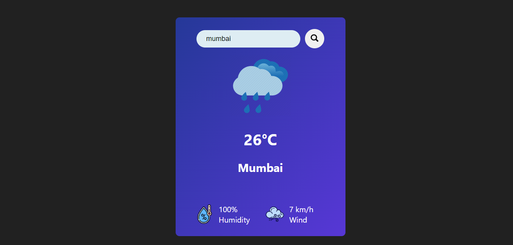

# Hi, I'm Ritam Mishra
## Frontend Developer
### Project Title - Weather App
A React project which shows the current weather of input location and by default it shows the weather of "London"
***
### Technoloy Used

### Time to complete this project 
4 hrs
***
### Screenshot

[Live Preview](https://weather-app-reactjs-lyart.vercel.app/)
***
## Lessons Learned
- useSate Hook 
- useEffect Hook
- Axios
***
